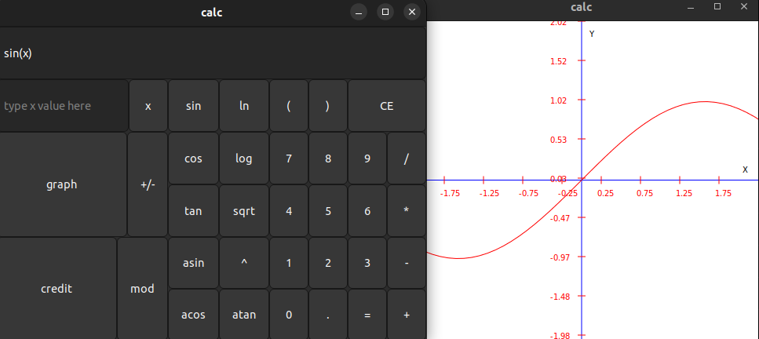

# SmartCalc v.1.0

## General information

Poor-quality calculator. Looks bad. Works bad as well. At least it manages to launch.

The program implements an engineering version of calculator using Dijkstra's algorithm. It converts every expresson into postfix notation and then performs calculation. Smart_Calc can plot function graphs in a new window with coordinate axis.

## Usage

Click the button with a specific label to input the calculating expression in infix notation into the input window. If a mistake occurs, click 'CE' button to clear the input. If calculating expression is done click '=' to see the result. If calculating expression involves 'x', its value can be entered into the specific window. To view the fucntion chart click the 'GRAPH' button. If errors exist in the input you'll see ERROR after clicking '=' button. To ensure correct results enclose each negative number within brackets. The program is unable to handle the scientific notation result, and you will encounter an error message if you attempt to perform further calculations. The program is able to provides a special credit mode . The input in this mode requires you to enter total credit amount, term, interest rate, type (annuity, differentiated). The output of it will be monthly payment, overpayment on credit, total payment.  

## Additional information

Makefile contains all, calc, install, uninstall, dist, dvi, test, clean targets. Use any of them for a specific purpose. Don't forget to edit 
$(INSTALL_PATH) Makefile variable before make install if you want. 

