# Part 1. Инструмент ipcalc

## 1.1. Сети и маски

Для работы используем утилиту ipcalc.

Определение адреса сети 192.167.38.54/13:

Перевод маски 255.255.255.0 в префиксную и двоичную запись:

Перевод маски /15 в обычную и двоичную запись:

Перевод маски 11111111.11111111.11111111.11110000 в префиксную и обычную запись:

Минимальный и максимальный хост в сети 12.167.38.4 при различных масках: 

/8:

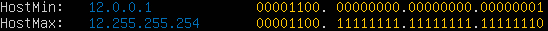

1111111.11111111.00000000.00000000:

255.255.254.0:

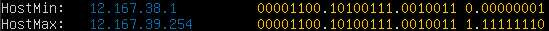

/4:

## 1.2. localhost

Используем ip a для вывода списка сетевых интерфейсов

Используем ipcalc для получения информации о сети для адреса 127.0.0.1/8

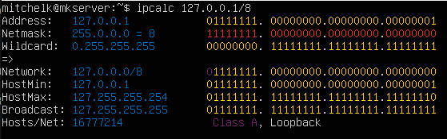

Из перечисленных IP адресов : 194.34.23.100, 127.0.0.2, 127.1.0.1, 128.0.0.1
в диапазон HostMin/HostMax войдут: 127.0.0.2, 127.1.0.1.

## 1.3. Диапазоны и сегменты сетей

По стандарту, для частных IP-адресов существуют три диапазона:

10.0.0.0 - 10.255.255.255 (10.0.0.0/8)
172.16.0.0 - 172.31.255.255 (172.16.0.0/12)
192.168.0.0 - 192.168.255.255 (192.168.0.0/16)

Публичные IP: 134.43.0.2, 172.0.2.1, 192.172.0.1, 172.68.0.2, 192.169.168.1
Частные IP: 10.0.0.45, 192.168.4.2, 172.20.250.4, 172.16.255.255, 10.10.10.10 

Для сети 10.10.0.0/18 возможны следующие IP адреса шлюза: 10.10.0.2, 10.10.10.10, 10.10.1.255
(10.0.0.1, 10.10.100.11 - невозможны)

# Part 2. Статическая маршрутизация между двумя машинами

Поднял вторую виртуальную машину.
Установил в настройках виртуальных машин Network - Internal network

Вызвал команду ip -a для просмотра сетевых интерфейсов 

Меняю настройки etc/netplan/00-installer-config.yaml для каждой машины.
Необходимо задать следующие адреса и маски: ws1 - 192.168.100.10, маска /16, ws2 - 172.24.116.8, маска /12

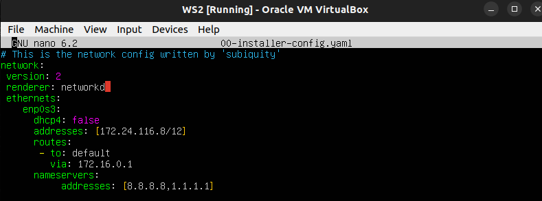

## 2.1. Добавить статический маршрут вручную

Задаю статический маршрут от одной машины к другой через команды:

для ws1: sudo ip r add 172.24.116.8 dev enp0s3
для ws2: sudo ip r add 192.168.100.10 dev enp0s3

результат выполнения команд можно увидеть в выводе команды ip route и вызвав команду:
для ws1: ping 172.24.116.8

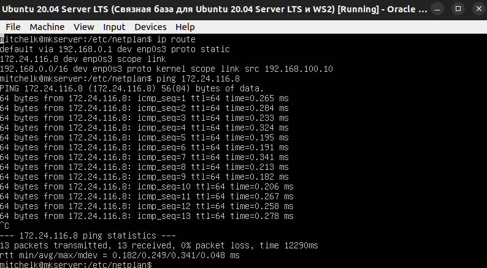

для ws2: ping 192.168.100.10

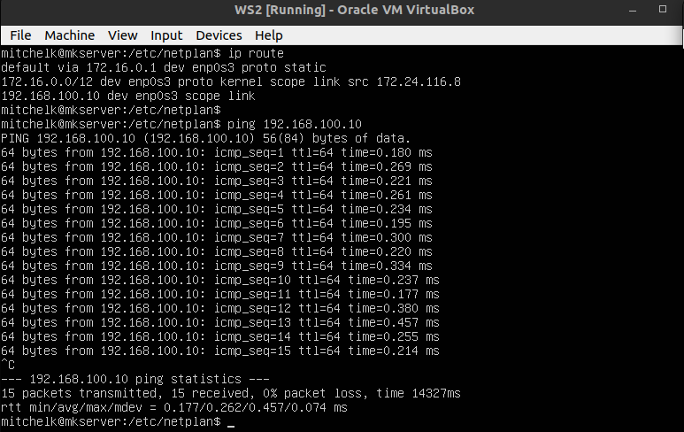

## 2.2. Добавить статический маршрут с сохранением

Добавить статический маршрут от одной машины до другой с помощью файла etc/netplan/00-installer-config.yaml

для ws1: ping 172.24.116.8
для ws2: ping 192.168.100.10

# Part 3. Утилита iperf3

## 3.1. Скорость соединения

8 Mbps = 1 MB/s
100 MB/s = 819200 Kbps
1 Gbps = 1024 Mbps

## 3.2. Утилита iperf3

Для измерения скорости соединения между ws1 и ws2 необходимо установить утилиту iperf3

На ws2 запускаем iperf3 в режиме сервера командой iperf3 -s
На ws1 вызываем iperf3 -c 172.24.116.8

 

# Part 4. Сетевой экран

## 4.1. Утилита iptables

Создать файл /etc/firewall.sh, имитирующий фаерволл, на ws1 и ws2.

Нужно добавить в файл подряд следующие правила:

1) На ws1 применить стратегию, когда в начале пишется запрещающее правило, а в конце пишется разрешающее правило (это касается пунктов 4 и 5)

2) На ws2 применить стратегию, когда в начале пишется разрешающее правило, а в конце пишется запрещающее правило (это касается пунктов 4 и 5)

3) Открыть на машинах доступ для порта 22 (ssh) и порта 80 (http)

4) Запретить echo reply (машина не должна «пинговаться», т.е. должна быть блокировка на OUTPUT)

5) Разрешить echo reply (машина должна «пинговаться»)

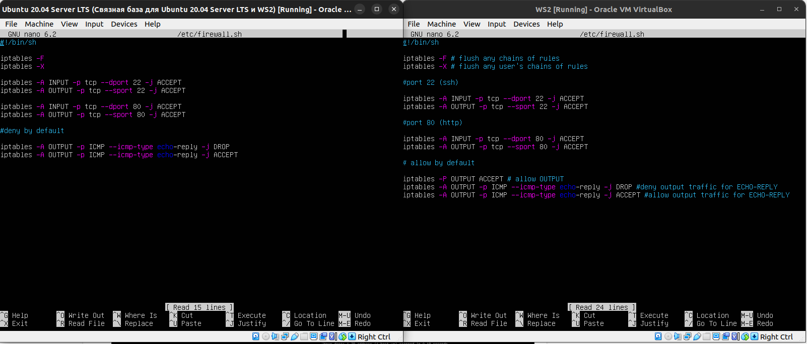

Протокол Internet Control Message Protocol (ICMP) – это набор коммуникационных правил, которые устройства используют для распространения информации об ошибках передачи данных в сети. 

Запустить файлы на обеих машинах командами chmod +x /etc/firewall.sh и /etc/firewall.sh

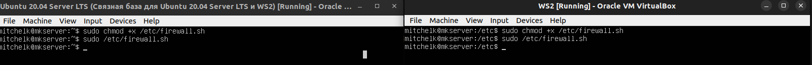

Allow by default (Разрешить по умолчанию): При использовании этой стратегии все трафики разрешаются по умолчанию, если для них не установлены явные правила блокировки. То есть все, что не запрещено, автоматически разрешено. Это может упростить управление брандмауэром, но может также привести к потенциальным уязвимостям, если нежелательные соединения не будут правильно заблокированы.

Deny by default (Запретить по умолчанию): При использовании этой стратегии все трафики блокируются по умолчанию, если для них не установлены явные правила разрешения. Это более безопасный подход, так как все, что не разрешено, будет автоматически заблокировано. Однако требует более тщательной настройки для разрешения необходимого трафика и может потребовать больше времени и усилий для управления. Если сначала стоит запрещающее правило, то оно имеет приоритет перед последующим разрешающим.

Выбор между этими стратегиями зависит от конкретных требований безопасности и сетевых сценариев. В некоторых случаях удобнее использовать "allow by default", чтобы упростить настройку и обслуживание системы. Однако в более критических средах чаще предпочитают "deny by default" для повышения безопасности и более строгого контроля над трафиком.

## 4.2. Утилита nmap

Командой ping находим машину, которая не «пингуется», это ws1. После чего утилитой nmap показываю, что хост машины запущен (в выводе nmap должно быть сказано: Host is up).

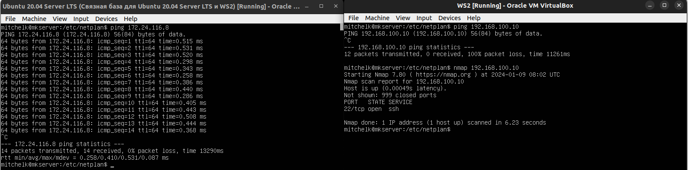

# Part 5. Статическая маршрутизация сети

Поднять пять виртуальных машин (3 рабочие станции (ws11, ws21, ws22) и 2 роутера (r1, r2))

## 5.1. Настройка адресов машин

Настроить конфигурации машин в etc/netplan/00-installer-config.yaml согласно сети на рисунке:

Конфигурация ws11:

r1 и r2:

ws21 и ws22:

Перезапустить сервис сети. Если ошибок нет, то командой ip -4 a проверить, что адрес машины задан верно.

Вывод команды для ws11:

r1 и r2:

ws21 и ws22:

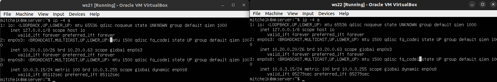

Пропинговать ws22 с ws21:

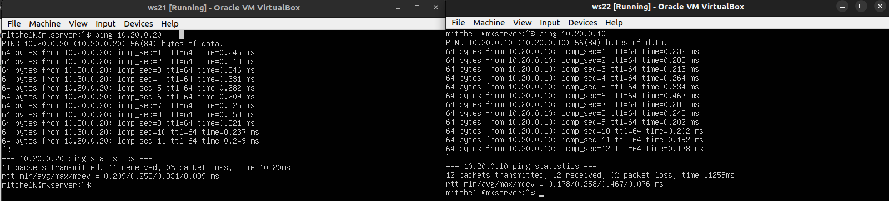

Пропинговать r1 с ws11:

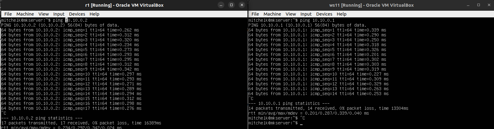

## 5.2. Включение переадресации IP-адресов

Для включения переадресации IP, выполнить команду на роутерах:
sysctl -w net.ipv4.ip_forward=1

Открыть файл /etc/sysctl.conf и добавить в него следующую строку:

net.ipv4.ip_forward = 1

При использовании этого подхода, IP-переадресация включена на постоянной основе.

## 5.3. Установка маршрута по-умолчанию

Настроить маршрут по-умолчанию (шлюз) для рабочих станций. Добавить `default` перед IP роутера в файле конфигураций для каждой рабочей машины

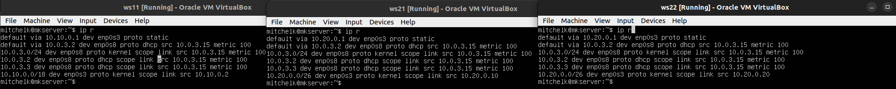

Пропинговать с ws11 роутер r2 и покажи на r2, что пинг доходит.с использованием команды:

`tcpdump -tn -i eth0`

tcpdump (от TCP и англ. dump — свалка, сбрасывать) — утилита UNIX, позволяющая перехватывать и анализировать сетевой трафик, проходящий через компьютер, на котором запущена данная программа. 

-tn - не отображает метку времени в каждой строке и отображает IP-адрес вместо имени хоста. 
-i  - указывает на то, какой сетевой интерфейс будет использоваться для захвата пакетов.

## 5.4. Добавление статических маршрутов

Добавь в роутеры r1 и r2 статические маршруты в файле конфигураций. Пример для r1 маршрута в сетку 10.20.0.0/26:

### Добавить в конец описания сетевого интерфейса eth1:

- to: 10.20.0.0
  via: 10.100.0.12

###  

Запустить команды на ws11:

`ip r list 10.10.0.0/[маска сети]` и `ip r list 0.0.0.0/0`

Адрес 0.0.0.0/0 в контексте сетевых настроек обозначает "любой адрес" или "весь IP-диапазон". Он используется для указания шлюза по умолчанию, что означает, что пакеты, для которых не определен более конкретный маршрут, будут направляться через этот шлюз.

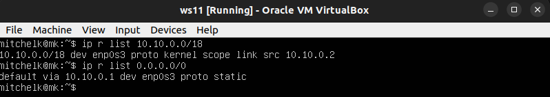

## 5.5. Построение списка маршрутизаторов

Запустить на r1 команду дампа:
`tcpdump -tnv -i eth0`

Программа tcpdump собирает пакеты до тех пор, пока процесс не будет прерван сигналом.

-t - не печатает время для каждой dump line, -n - не преобразует адреса (i.e., host addresses, port numbers, etc.)
-v - предоставляет более подробный вывод, -i - слушает интерфейс.

При помощи утилиты **traceroute** построить список маршрутизаторов на пути от ws11 до ws21

Утилита Traceroute вместо ICMP-запроса отправляет 3 UDP-пакета на определенный порт целевого хоста и ожидает ответа о недоступности этого порта. Первый пакет отправляется с TTL=1, второй с TTL=2 и так далее, пока запрос не попадёт адресату (TTL - time to live - время жизни пакета). Каждый хост его -=TTL Так как вместо ICMP-запроса он отправляет UDP-запрос, в каждом запросе есть порт отправителя и порт получателя. Когда запрос попадёт на хост назначения, этот хост отправит ответ о недоступности порта «Destination port unreachable» (порт назначения недоступен). Это значит, что адресат получил запрос. Traceroute воспримет этот ответ как завершение трассировки и выведет на экран всю информацию.

## 5.6. Использование протокола **ICMP** при маршрутизации

Протокол Internet Control Message Protocol (ICMP) – это набор коммуникационных правил, которые устройства используют для распространения информации об ошибках передачи данных в сети. При обмене сообщениями между отправителем и получателем могут возникнуть непредвиденные ошибки. Например, сообщения могут быть слишком длинными или пакеты данных могут приходить не по порядку, поэтому получатель не может их организовать. В таких случаях получатель использует ICMP для информирования отправителя сообщением об ошибке и просит отправить сообщение повторно.

Запустить на r1 перехват сетевого трафика, проходящего через enp0s3:

Пропинговать с ws11 несуществующий IP (например, *10.30.0.111*) с помощью команды:

`ping -c 1 10.30.0.111`

# Part 6. Динамическая настройка IP с помощью **DHCP**

Для r2 настроить в файле */etc/dhcp/dhcpd.conf* конфигурацию службы **DHCP**:

Указать адрес маршрутизатора по-умолчанию, DNS-сервер и адрес внутренней сети. Пример файла для r2:

subnet 10.100.0.0 netmask 255.255.0.0 {}

subnet 10.20.0.0 netmask 255.255.255.192
{
    range 10.20.0.2 10.20.0.50;
    option routers 10.20.0.1;
    option domain-name-servers 10.20.0.1;
}

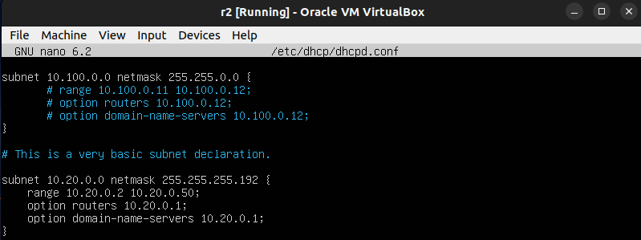

В файле resolv.conf прописать nameserver 8.8.8.8.

Перезагрузить службу **DHCP** командой `systemctl restart isc-dhcp-server`

Перезагрузить службу **DHCP** командой `systemctl restart isc-dhcp-server`
Машину ws21 перезагрузить при помощи `reboot`
Посмотреть статус isc-dhcp-server командой `systemctl status isc-dhcp-server`

Вывод команды ip a для ws21:

Пропинговать ws22 c ws21:

Добавить строки: `macaddress: 10:10:10:10:10:BA`, `dhcp4: true` в настройки netplan ws11:

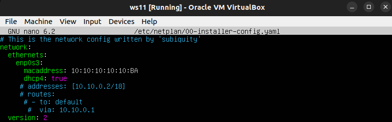

Для r1 настроить аналогично r2, но сделать выдачу адресов с жесткой привязкой к MAC-адресу (ws11):

Вызываем reboot на ws11 и смотрим вывод ip a

Пропинговать r1 с ws11:

Запросить с ws21 обновление ip адреса:

До:

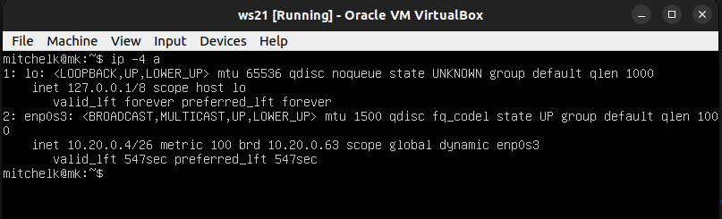

После:

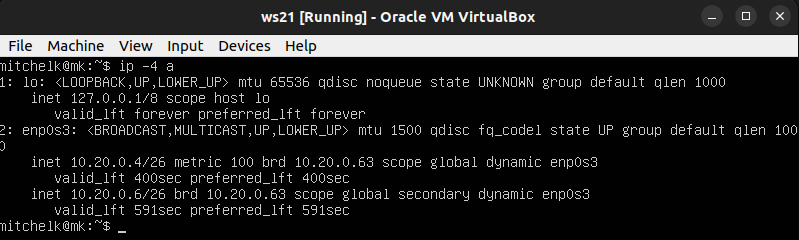

Для обновления ip адреса используется команда dhclient -v. DHCP-клиент (dhclient) отправляет запрос на DHCP-сервер для обновления своих сетевых настроек, включая IP-адрес. Режим -v означает "verbose" и выводит более подробную информацию о процессе.

# Part 7. **NAT**

Apache — это свободное программное обеспечение, с помощью которого можно создать веб-сервер.

В файле */etc/apache2/ports.conf* на ws22 и r1 изменить строку `Listen 80` на `Listen 0.0.0.0:80`, то есть сделать сервер Apache2 общедоступным:

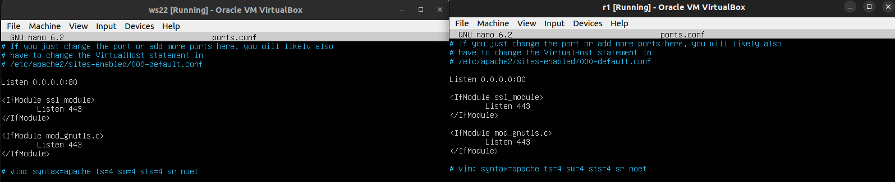

Запустить веб-сервер Apache командой `service apache2 start` на ws22 и r1:

Добавить в фаервол, созданный по аналогии с фаерволом из Части 4, на r2 следующие правила:

1) Удаление правил в таблице filter - `iptables -F`
2) Удаление правил в таблице "NAT" - `iptables -F -t nat`
3) Отбрасывать все маршрутизируемые пакеты - `iptables --policy FORWARD DROP`

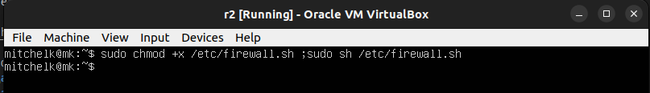

Проверить соединение между ws22 и r1 командой `ping`
*При запуске файла с этими правилами, ws22 не должна «пинговаться» с r1*

Добавить в файл ещё одно правило:

4) Разрешить маршрутизацию всех пакетов протокола **ICMP**

Проверить соединение между ws22 и r1 командой `ping`
*При запуске файла с этими правилами, ws22 должна «пинговаться» с r1*

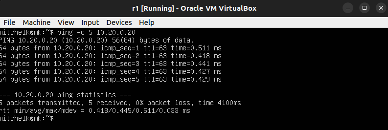

Добавить в файл ещё два правила:

5) Включить **SNAT**, а именно маскирование всех локальных ip из локальной сети, находящейся за r2 (по обозначениям из Части 5 - сеть 10.20.0.0)

6) Включить **DNAT** на 8080 порт машины r2 и добавить к веб-серверу Apache, запущенному на ws22, доступ извне сети

Запустить файл.

Проверить соединение по TCP для **SNAT**: для этого с ws22 подключиться к серверу Apache на r1 командой:
`telnet [адрес] [порт]`

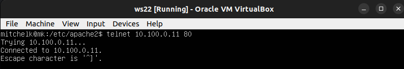

Проверить соединение по TCP для **DNAT**: для этого с r1 подключиться к серверу Apache на ws22 командой `telnet` (обращаться по адресу r2 и порту 8080)

# Part 8. Дополнительно. Знакомство с **SSH Tunnels**

SSH (Secure SHell - защищенная оболочка) — сетевой протокол прикладного уровня, предназначеный для безопасного удаленного доступа к UNIX-системам.

Запустить на r2 фаервол с правилами из Части 7.
Запустить веб-сервер **Apache** на ws22 только на localhost (то есть в файле */etc/apache2/ports.conf* измени строку `Listen 80` на `Listen localhost:80`)

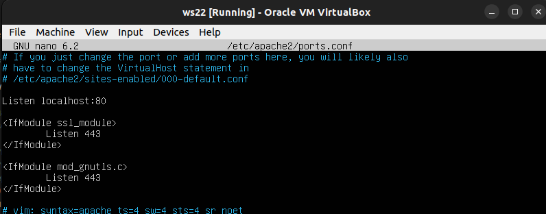

Listen localhost:80:

Эта инструкция указывает веб-серверу слушать только запросы, поступающие на локальный (127.0.0.1) интерфейс на порту 80.
Сервер будет принимать запросы только от локальной машины (localhost).

Воспользоваться *Local TCP forwarding* с ws21 до ws22, чтобы получить доступ к веб-серверу на ws22 с ws21:

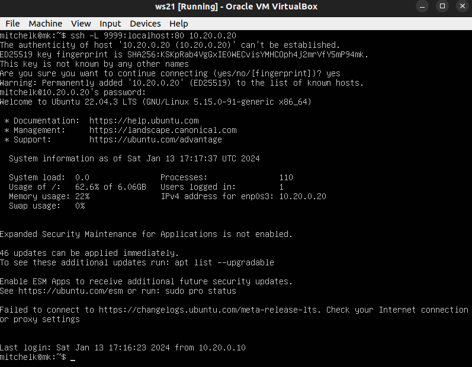

Команда ssh -L используется для создания локального порт-форвардинга (local port forwarding) с использованием SSH. 
Эта команда создает SSH туннель, который пересылает весь трафик, поступающий на локальный порт 9999, на удаленный сервер (10.20.0.20) на порт 80.

Воспользоваться *Remote TCP forwarding* c ws11 до ws22, чтобы получить доступ к веб-серверу на ws22 с ws11:

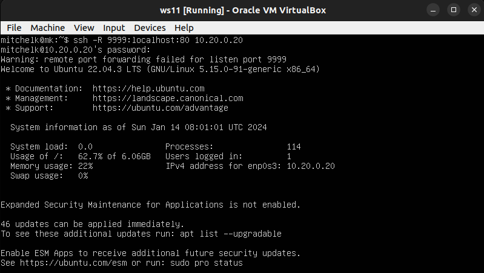

Команда ssh -R используется для настройки удаленного порт-форвардинга (remote port forwarding) с использованием SSH.
Эта команда создает SSH туннель, который перенаправляет весь трафик, поступающий на удаленный порт 9999, на ваш локальный компьютер на порт 80.

Для проверки, сработало ли подключение в обоих предыдущих пунктах выполнить команду:
`telnet 127.0.0.1 [локальный порт]`

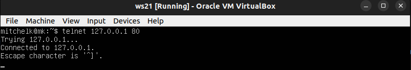

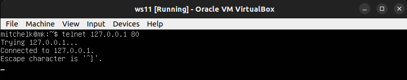

